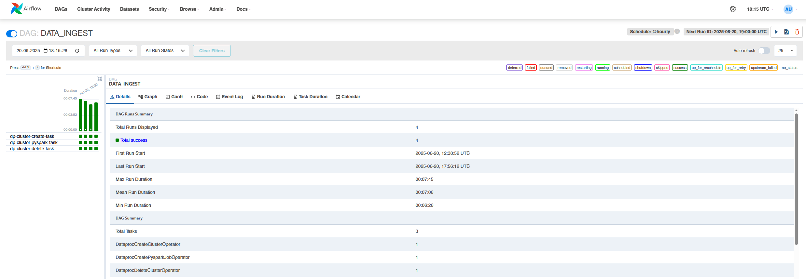

# Отчет по итоговому заданию ETL (4 модуль)

### Задание 1. Работа с Yandex DataTransfer

- Вручную создана таблица в YDB
   <details>
    <summary><i>SQL-скрипт для создания таблицы</i></summary>

   ### sql-скрипт создания таблицы в YDB
    ```sql
    CREATE TABLE weather_data (
    location Utf8,
    date_time Timestamp,
    temperature_c Double,
    humidity_pct Double,
    precipitation_mm Double,
    wind_speed_kmh Double,
    PRIMARY KEY (location, date_time)
    );
    ```
  </details> 
  
- В созданную таблицу с помощью CLI загружен датасет transaction_v2
  <details>
    <summary><i>bash скрипт</i></summary>

    ### bash-скрипт загрузки датасета
    ```bash
    ydb --endpoint grpcs://ydb.serverless.yandexcloud.net:2135 \
    --database /ru-central1/b1gfhcse172450fifcje/etn3p0qk8go18m3m7lfs \
    --sa-key-file ~/authorized_key.json \
    import file csv \
    --path weather_data \
    --delimiter "," \
    --skip-rows 1 \
    --null-value "" \
    "$(pwd)/weather_data.csv"
     ```
  </details> 

- Создан трансфер данных с источником в YDB и приемником в Object Storage
      <details>
    	<summary><i>Тут скриншоты разных этапов задачи</i></summary>
	  - 
  
    - 
  
  	- 
 
  	- 
 
  	- 
  	 </details> 


### Задание 2. Автоматизация работы с Yandex Data Processing при помощи Apache AirFlow

- Подготовлена инфраструктура (Managed service for Airflow)
      <details>
    	<summary><i>Тут скриншот</i></summary>
	    	- 
  	 </details> 
    
- Создан DAG **DATA_INGEST**, который:
    - Создает Data Proc кластер.      
    - Запускает на кластере PySpark-задание для обработки Parquet-файла.
    - После завершения работы задания удаляет кластер.
  <details>
    	<summary><i>Тут текст DAG</i></summary>
  
	 ### Data-proc-DAG.py
  
	 ```python
	  import uuid
    import datetime
    from airflow import DAG
    from airflow.utils.trigger_rule import TriggerRule
    from airflow.providers.yandex.operators.yandexcloud_dataproc import (
    DataprocCreateClusterOperator,
    DataprocCreatePysparkJobOperator,
    DataprocDeleteClusterOperator,
    )

    # Данные вашей инфраструктуры
    YC_DP_AZ = 'ru-central1-a'
    YC_DP_SSH_PUBLIC_KEY = 'ssh-ed25519 AAAAC3NzaC1lZDI1NTE5AAAAICkmBqc3tcoxT2HR5ZJmIoc8s6JQA2QpXo0LieuQ0uQX'
    YC_DP_SUBNET_ID = 'e9ba04povek3lmtgcii4'
    YC_DP_SA_ID = 'ajedll5qllfivmvnm982'
    YC_DP_METASTORE_URI = '10.128.0.14'
    YC_BUCKET = 'databacket'

    # Настройки DAG
    with DAG(
          'DATA_INGEST',
          schedule_interval='@hourly',
          tags=['data-processing-and-airflow'],
          start_date=datetime.datetime.now(),
          max_active_runs=1,
          catchup=False
    ) as ingest_dag:
    # 1 этап: создание кластера Yandex Data Proc
    create_spark_cluster = DataprocCreateClusterOperator(
         task_id='dp-cluster-create-task',
         cluster_name=f'tmp-dp-{uuid.uuid4()}',
         cluster_description='Временный кластер для выполнения PySpark-задания под оркестрацией Managed Service for Apache Airflow™',
         ssh_public_keys=YC_DP_SSH_PUBLIC_KEY,
         service_account_id=YC_DP_SA_ID,
         subnet_id=YC_DP_SUBNET_ID,
         s3_bucket=YC_BUCKET,
         zone=YC_DP_AZ,
         cluster_image_version='2.1',
         masternode_resource_preset='s2.small',  # минимальный ресурсный пресет
         masternode_disk_type='network-hdd',
         masternode_disk_size=32,  # уменьшенный размер диска
         computenode_resource_preset='s2.small',  # уменьшенный ресурсный пресет
         computenode_disk_type='network-hdd',
         computenode_disk_size=32,  # уменьшенный размер диска
         computenode_count=1,  # уменьшенное количество узлов
         computenode_max_hosts_count=3,  # уменьшенное максимальное масштабирование
         services=['YARN', 'SPARK'],
         datanode_count=0,
         properties={
             'spark:spark.hive.metastore.uris': f'thrift://{YC_DP_METASTORE_URI}:9083',
         },
     )

    # 2 этап: запуск задания PySpark
    poke_spark_processing = DataprocCreatePysparkJobOperator(
         task_id='dp-cluster-pyspark-task',
         main_python_file_uri=f's3a://{YC_BUCKET}/scripts/clean-data.py',
     )

    # 3 этап: удаление кластера Yandex Data Processing
    delete_spark_cluster = DataprocDeleteClusterOperator(
         task_id='dp-cluster-delete-task',
         trigger_rule=TriggerRule.ALL_DONE,
     )

    # Формирование DAG из указанных выше этапов
    create_spark_cluster >> poke_spark_processing >> delete_spark_cluster
  	```
</details>

- Внутри есть скрипт-задание
  <details>
    <summary><i>Тут текст скрипта</i></summary>
  
	### clean-data.py
		  
	```python
 	from pyspark.sql import SparkSession
 	from pyspark.sql.functions import col, to_date
 	from pyspark.sql.types import IntegerType, StringType, BooleanType
 	from pyspark.sql.utils import AnalysisException
 	
 	
 	# === Spark session ===
 	spark = SparkSession.builder.appName("Parquet ETL with Logging to S3").getOrCreate()
 	
 	
 	# === Пути ===
 	source_path = "s3a://databacket/weather_data.csv"
 	target_path = "s3a://databacket/weather_data.parquet"
 	
 	try:
 	    print(f"Чтение данных из: {source_path}")
 	    df = spark.read.option("header", "true").option("inferSchema", "true").csv(source_path)
 	
 	    print("Схема исходных данных:")
 	    df.printSchema()
 	
 	    # Приведение типов + формат даты YYYYMMDD
 	    df = df.withColumn("location", col("location").cast(StringType())) \
 	           .withColumn("date_time", to_date(col("date_time").cast("string"), "yyyyMMdd")) \
 	           .withColumn("temperature_c", col("temperature_c").DoubleType())) \
 	           .withColumn("humidity_pct", col("humidity_pct").DoubleType())) \
 	           .withColumn("precipitation_mm", col("precipitation_mm").DoubleType())) \
 	           .withColumn("wind_speed_kmh", col("wind_speed_kmh").DoubleType())
 	
 	    print("Схема преобразованных данных:")
 	    df.printSchema()
 	
 	    # Удаление строк с пропущенными значениями
 	    df = df.na.drop()
 	
 	    print("Пример данных после преобразования:")
 	    df.show(5)
 	
 	    print(f"Запись в Parquet: {target_path}")
 	    df.write.mode("overwrite").parquet(target_path)
 	
 	    print("✅ Данные успешно сохранены в Parquet.")

 	except AnalysisException as ae:
 	    print("❌ Ошибка анализа:", ae)
 	except Exception as e:
 	    print("❌ Общая ошибка:", e)
 
 	spark.stop()
 	```
	
</details> 

  <details>
  	<summary><i>Тут остальные скриншоты</i></summary>
	
  - 
	
  - 

  - 
  
  </details> 

  ### Задание 4. Визуализация в Yandex DataLens

  Скрин приложен из домашнего задания по предмету "Семинар наставника" т.к. там просто посимпотичнее получилась визуализация
  PS если успею перезалью данные и сделаю новый дашборд

  <details>
  	<summary><i>Тут скриншот</i></summary>
	
  - 
	 
  </details> 

  <details>
  	<summary><i>Тут ссылка на репу с ДЗ по предмету "семинар наставника"</i></summary>
	
    https://github.com/Narasslabone/hse_hw_ms
	 
  </details>
